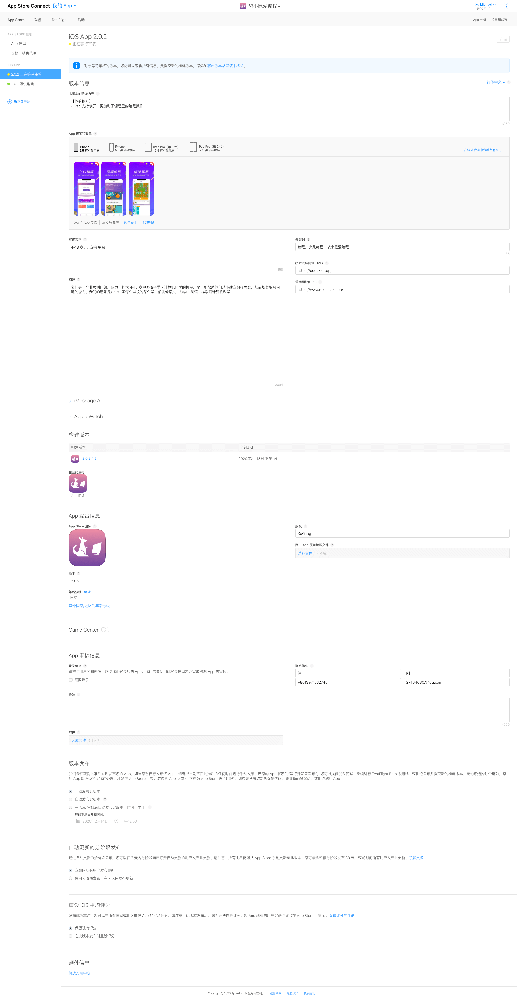

## 简介
本项目是使用 [React Native](https://facebook.github.io/react-native/) 开发的应用。  
该应用主要是面对 4-18 岁青少儿在线编程课程的学习。核心课程来自于 Code.org&reg;，它是一家非营利组织，致力于通过在更多学校推出计算机科学，以及增加女性和代表性不足的学生的参与度来扩大计算机科学的参与。他们很自豪能够在全球范围内完全免费提供他们的所有课程和课程内容，而无需任何必要的合作伙伴关系来在您的学校或组织中使用我们的材料！而我们也基于此种精神，致力于扩大 4-18 岁中国孩子学习计算机科学的机会，尽可能帮助他们从小建立编程思维，从而培养解决问题的能力。  
我们的愿景是：让中国每个学校的每个学生都能像语文、数学、外语一样学习计算机科学。

## 技术栈
React Native 0.60 + Ant Design Mobile RN of React 3.0 + Redux

## 截图  

  

  

## 目录
1. [环境安装](#环境安装)
    * [安装 Nvm](#安装Nvm)
    * [安装 Node](#安装Node)
    * [安装 Nrm](#安装Nrm)
    * [安装 Homebrew](#安装Homebrew)
    * [安装 Watchman](#安装Watchman)
    * [安装 JDK](#安装JDK)
    * [安装 Yarn](#安装Yarn)
    * [安装 React Native CLI](#安装ReactNativeCLI)
2. [搭建流程](#搭建流程)
    * [设置路径别名](#设置路径别名)
    * [添加导航器](#添加导航器)
    * [安装 Ant Design Mobile of React](#安装AntDesignMobileofReact)
    * [添加名称、图标、启动图](#添加名称图标启动图)
    * [添加 Webview](#添加Webview)
    * [Android 打包](#Android打包)
    * [iOS 打包](#iOS打包)

## <a name="环境安装">环境安装</a>
> 参考 [react-native 官网](https://facebook.github.io/react-native/docs/getting-started)
### <a name="安装Nvm">安装 Nvm</a>
```shell
# 安装 nvm (npm 安装和版本管理工具，最新版本请到 https://github.com/nvm-sh/nvm 查看)
curl -o- https://raw.githubusercontent.com/nvm-sh/nvm/v0.34.0/install.sh | bash 
```

### <a name="安装Node">安装 Node</a>
```shell
# 其他版本号，请查看 https://nodejs.org/zh-cn/download/releases/ ，也可执行 `npm install -g n` 和 `sudo n stable` 命令升级
nvm install 8.16.0
```

### <a name="安装Nrm">安装 Nrm</a>
```shell
# 安装 nrm
npm install -g nrm

# 列出 npm 源列表
nrm ls

# 切换为淘宝源
nrm use taobao
```

### <a name="安装Homebrew">安装 Homebrew</a>
```shell
# 安装 Homebrew（Mac 系统的包管理器，用于安装 macOS 没有预装，但你需要的东西）
/usr/bin/ruby -e "$(curl -fsSL https://raw.githubusercontent.com/Homebrew/install/master/install)"

# 卸载 Homebrew
/usr/bin/ruby -e "$(curl -fsSL https://raw.githubusercontent.com/Homebrew/install/master/uninstall)"

# 验证 Homebrew 是否正确安装
brew doctor

# 修改 Homebrew 源（因为默认是链接国外服务器，速度会很慢，此处修改为国内的）
cd "$(brew --repo)"
git remote set-url origin https://mirrors.tuna.tsinghua.edu.cn/git/homebrew/brew.git
cd "$(brew --repo)/Library/Taps/homebrew/homebrew-core"
git remote set-url origin https://mirrors.tuna.tsinghua.edu.cn/git/homebrew/homebrew-core.git
```
### <a name="安装Watchman">安装 Watchman</a>
```shell
# Watchman是由Facebook提供的监视文件系统变更的工具。安装此工具可以提高开发时的性能（packager可以快速捕捉文件的变化从而实现实时刷新）。
brew install watchman
```  

### <a name="安装JDK">安装 JDK</a>
```shell
# 确保是JDK 8 或更高版本
brew tap AdoptOpenJDK/openjdk
brew cask install adoptopenjdk8
```  

### <a name="安装Yarn">安装 Yarn</a>
```shell
# 安装 yarn (如果您选择手动安装，用以下步骤添加 Yarn 到 path 变量)
brew install yarn --ignore-dependencies

# 修改 yarn 源
yarn config set registry https://registry.npm.taobao.org --global
yarn config set disturl https://npm.taobao.org/dist --global
```  

### <a name="安装ReactNativeCLI">安装 React Native CLI</a>
```shell
npm install -g react-native-cli
```

## <a name="搭建流程">搭建流程</a>
### <a name="初始化项目">初始化项目</a>
```shell
react-native init StudentMultiNativeClient
```  
### <a name="设置路径别名">设置路径别名</a>
1. 安装 Babel 模块解析插件
```shell
npm install --save-dev babel-plugin-module-resolver
```  
2. 配置 Babel 模块解析插件
```shell
rm -rf ./babel.config.js
vim .babelrc
```  
```js
...
{
    "presets": [
        "module:metro-react-native-babel-preset"
    ],
    "plugins": [
        [
            "module-resolver",
            {
                "root": [
                    "./"
                ],
                "extensions": [
                    ".ios.js",
                    ".android.js",
                    ".js",
                    ".json"
                ],
                "alias": {
                    "@/src": "./src",
                },
            }
        ]
    ]
}
...
```  
3. 配置 Visual Studio Code 使其支持路径提示
```shell
vim jsconfig.json
```  
```js
...
{
  "compilerOptions": {
    "baseUrl": "./",
    "paths": {
      "@/src": [
        "./src"
      ]
    }
  }
}
...

``` 

### <a name="添加导航器">添加导航器</a>
> 参考 [react-navigation 官网](https://www.npmjs.com/package/react-navigation)
1. 安装导航器
```shell
npm install react-navigation
npm install react-native-gesture-handler react-native-reanimated

# React Native 0.60 and higher
cd ios
pod install
cd ..

# React Native 0.59 and lower 参考官网
```
2. 修改入口组件 `App.js`  
```js
...
// 载入导航器
import { createStackNavigator, createAppContainer } from "react-navigation";
// 载入组件
import Index from '@/src/pages/index/index.js';
import MessageList from '@/src/pages/index/message_list.js';

const App = createStackNavigator(
  {
    Index: Index,
    MessageList: MessageList
  },
  {
    initialRouteName: "Index"
  })
export default createAppContainer(App);
...
```  

### <a name="安装AntDesignMobileofReact">安装 Ant Design Mobile of React</a>
1. 安装 Ant Design Mobile of React
```shell
npm install @ant-design/react-native --save

# Link icon fonts
react-native link @ant-design/react-native
```  
2. 按需加载
```shell
npm install babel-plugin-import --save-dev
vim `.babelrc`
```  
```js
...
"plugins": [
        ...
        [
            "import",
            {
                "libraryName": "@ant-design/react-native"
            }
        ],
        ...
]
...
```  
```js
// 引用 Ant Design Mobile of React Button
import { Button } from '@ant-design/react-native';
...
```  
3. 自定义主题
```shell
cp node_modules/@ant-design/react-native/lib/style/themes/default.js src/assets/scripts/custom-rn-theme.js

vim src/assets/scripts/custom-rn-theme.js
```  
```js
...
const path = require('path');
const fs = require('fs');
// for 1.x
// const defaultVars = require('antd-mobile/lib/style/themes/default');
// for 2.x
const defaultVars = require('@ant-design/react-native/lib/style/themes/default');
const customVars = require('../../styles/theme');
// for 1.x
// const themePath = path.resolve(require.resolve('antd-mobile'), '../style/themes/default.js');
// for 2.x
const themePath = path.resolve(require.resolve('@ant-design/react-native'), '../style/themes/default.js');
const themeVars = Object.assign({}, defaultVars, customVars);

if (fs.statSync(themePath).isFile()) {
  fs.writeFileSync(
    themePath,
    "'use strict';Object.defineProperty(exports, '__esModule', {value: true});var brandPrimary = '#000'; var brandPrimaryTap = '#6b40bd';exports['default'] = " + JSON.stringify(themeVars) + " \n module.exports = exports['default'];"
  );
}
...
```
```shell
vim package.json
```
```js
...
"theme": "node ./src/assets/scripts/custom-rn-theme",
...
```  

### <a name="添加Webview">添加 Webview</a>  
> 参考 [react-native-webview](https://github.com/react-native-community/react-native-webview/blob/HEAD/docs/Getting-Started.md)
```shell
npm install --save react-native-webview
react-native link react-native-webview
cd ios && pod install
```  

### <a name="添加名称图标启动图">添加名称、图标、启动图</a> 
#### 资源类型对比
类型 | 优势 | 劣势
----|------|----
图片(打包) | 使用方便，直接用require和Image标签就可以使用  | bundle体积增大，特别是热更新对流量，影响太大。需要根据屏幕不同准备多种尺寸
图片(URI) | 同上，更换方便，远程管理  | 基本同上，缓存管理比较麻烦，需要另外的库
IconFont | 随app打包，文件小，使用便利，不用担心屏幕屏幕尺寸  | 不能热更新，需要引入额外的库
svg(打包) | 文件极小，可随bundle热更新，可缩放图形，不用担心屏幕尺寸问题  | 需要引入额外的库
svg(URI) | 基本同图片，不用担心屏幕尺寸  | 缓存		

#### 修改应用名称
##### Android
编辑 `android/app/src/main/res/values/strings.xml` 文件：  
```
<resources>
-    <string name="app_name">StudentMultiNativeClient</string>
+    <string name="app_name">袋小鼠编程</string>   
</resources>
```  
##### iOS
编辑 `ios/taroDemo/Info.plist` 文件：  
```
<key>CFBundleDisplayName</key>
- <string>taroDemo</string>
+ <string>袋小鼠编程</string>
```  
#### 修改应用图标
使用[图标工厂](https://icon.wuruihong.com/)在线生成应用图标，[一键改图](https://yijiangaitu.com/radius)在线处理应用图标
##### Android
替换 `android/app/src/main/res` 下对应的图标
##### iOS
用 XCode 打开项目，点击 `Images.xcassets > AppIcon` 拖入相应尺寸的图标（如果没有你需要的设备，可以删除 `AppIcon` 重新新建一个 `AppIcon` 就有了全部设备）。  

#### 修改应用启动图
使用[图标工厂](https://icon.wuruihong.com/)在线生成应用启动图，[一键改图](https://yijiangaitu.com/radius)在线处理应用启动图
##### Android
安卓没有默认启动图，可以通过 `react-native-splash-screen` 包解决
##### iOS
1. 用 XCode 打开项目，选中 `LaunchScreen.xib` 中的 View，取消选中 `Use Launch Screen`。
2. 选中项目，在 `General` 配置中设置 `Launch Images Srouce`，点击 `Use Asset Catalog`，弹出对话框中使用默认即可（此操作会在 `Images.xcassets` 中创建 `LaunchImage`），然后设置 `Launch Screen File` 为空。
3. 点击 `Images.xcassets` > `LaunchImage`，在右侧属性栏处选择要支持的设备。  

#### 启动图尺寸对比
屏幕尺寸 | 适用机型 | 像素
----|------|----
Retina HD 5.5 | 6p/7p/6sp/7sp | @3x  :414 736 (12422208)
Retina HD 4.7 | 6/7/6s/7s | @2x  :375667 (7501334)
2x  (3.5)   | 4 | @2x  :320480 (640960)
Retina 4 | 5/5s/SE | @2x  :320568 (640*1136)

#### 启动图命名
| **启动图名字** | **适用机型** | **LaunchImage对应位置** | **Size** |
| --- | --- | --- | --- |
| Default-568h@2x.png | 5/5s/SE | Retina 4 | 640\*1136 |
| Default-667h@2x.png | 6/7/6S/7S | Retina HD 4.7 | 750\*1334 |
| Default-736h@3x.png | 6P/7P/6SP/7SP | Retina HD 5.5 | 1242\*2208 |
| Default@2x.png | 4 | 2x | 640\*960 |  

| **对应iOS版本** | **LaunchImage对应位置** | **对应size** | **倍率** |
| --- | --- | --- | --- |
| iPhone Portrait iOS 8 | Retina HD 5.5 | （1242×2208） | @3x |
| iPhone Portrait iOS 8- | Retina HD 4.7 | （750×1334） | @2x |
| iPhone Portrait iOS 7,8 | 2x | （640×960） | @2x |
| iPhone Portrait iOS 7,8 | Retina 4 | （640×1136） | @2x |
| iPhone Portrait iOS 5,6 | 1x | （320×480） | @1x |
| iPhone Portrait iOS 5,6 | 2x | （640×960） | @2x |
| iPhone Portrait iOS 5,6 | Retina4 | （640×1136） | @2x |  

| **对应iPad版本** | **LaunchImage对应位置** | **对应size** |
| --- | --- | --- |
| Retina iPad | Default-Portrait@2x.png | (1536x2048 ~ for Retina iPad Portrait) |
| Retina iPad | Default-Landscape@2x.png | (2048x1536 ~ for Retina iPad Landscape) |
| iPad Mini/iPad | Default-Portrait~ipad.png | (768x1024 ~ for iPad Portrait) |
| iPad Mini/iPad | Default-Landscape~ipad.png | (1024x768 ~ for iPad Landscape) |  


### <a name="Android打包">Android 打包</a>  
> 参考 [react-native 官网](https://reactnative.cn/docs/signed-apk-android/#docsNav)
1. 生成一个签名密钥，`student` 字段为你的项目标识
```shell
cd android/app
keytool -genkeypair -v -keystore student-release-key.keystore -alias student-key-alias -keyalg RSA -keysize 2048 -validity 10000
```  
2. 设置 gradle 变量 `android/gradle.properties`，`123456` 为你的生成签名秘钥填写的密码
> * 一旦你在 Play Store 发布了你的应用，如果想修改签名，就必须用一个不同的包名来重新发布你的应用（这样也会丢失所有的下载数和评分）。所以请务必备份好你的密钥库和密码。
> * 如果你不想以明文方式保存密码，同时你使用的是 macOS 系统，那么你也可以把密码保存到钥匙串（Keychain）中。这样一来你就可以省略掉下面配置中的后两行（即 MYAPP_RELEASE_STORE_PASSWORD 和 MYAPP_RELEASE_KEY_PASSWORD）
```js
...
MYAPP_RELEASE_STORE_FILE=my-release-key.keystore
MYAPP_RELEASE_KEY_ALIAS=my-key-alias
MYAPP_RELEASE_STORE_PASSWORD=123456
MYAPP_RELEASE_KEY_PASSWORD=123456
...
```  
3. 把签名配置加入到项目的 gradle 配置中， `android/app/build.gradle`
```js
...
android {
    ...
    defaultConfig { ... }
    signingConfigs {
        release {
            if (project.hasProperty('MYAPP_RELEASE_STORE_FILE')) {
                storeFile file(MYAPP_RELEASE_STORE_FILE)
                storePassword MYAPP_RELEASE_STORE_PASSWORD
                keyAlias MYAPP_RELEASE_KEY_ALIAS
                keyPassword MYAPP_RELEASE_KEY_PASSWORD
            }
        }
    }
    buildTypes {
        release {
            ...
            signingConfig signingConfigs.release
        }
    }
}
// 避免过期组件导致打包失败配置
subprojects {
    gradle.projectsEvaluated {
        tasks.withType(Compile) {
            options.compilerArgs << "-Xlint:unchecked -Xlint:deprecation"
        }
    }
}
```  
4. 生成发行 APK 包
```shell
cd android
./gradlew assembleRelease // 生成的 APK 文件位于 android/app/build/outputs/apk/release/app-release.apk
```  

### <a name="iOS打包">iOS 打包</a>  
1. 请自行官网注册 [Apple Developer](https://developer.apple.com) 会员，
2. 在 Xcode 中选择 Preferences -> Account ，登录你的 Apple ID 
3. 点击左侧项目目录，然后在右侧 TARGETS 中选择你需要发布的项目，再选择 General -> Signing -> Team 中选择你的 Apple ID 
4. 在 Xcode 中选择 Product -> Scheme -> Edit Scheme，然后选择 Run 选项卡，将 Build Configuration 设置为 Release (需要实时调试再将 Buiid Configuration 改为 debug )
5. 在 Xcode 中选择 Product -> Archive，过会弹出面板，就可以按照面板中的提示，导出 .ipa 文件或发布到 App Store 了
6. 访问 [Appstore Connect](https://appstoreconnect.apple.com/WebObjects/iTunesConnect.woa/ra/ng/app) 登录你的 Apple ID，创建对应的“版本或平台”，填写资料提交审核，如下图：  

  

> 通过 Xcode 上传 ipa 时，如果一直卡在 Authenticating... ，请执行以下命令：  
```bash
cd ~
mv .itmstransporter/ .old_itmstransporter/ 
"/Applications/Xcode.app/Contents/SharedFrameworks/ContentDeliveryServices.framework/itms/bin/iTMSTransporter" // 该命令如果执行报错，请自行查找 `iTMSTransporter` 的路径替换
```  

